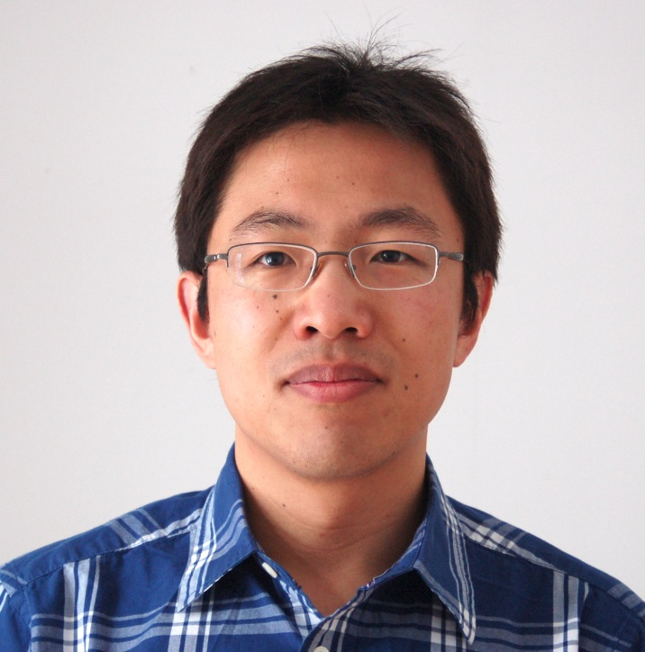

刘佐伟，南京大学物理学院教授。2003年复旦大学本科毕业;2008年美国东北大学博士毕业;2008年至2011年在美国纽约州立大学石溪分校杨振宁理论物理研究所做博士后研究；2011年至2014年在加拿大麦吉尔大学做博士后研究；2014年至2016年在清华大学任副研究员；2016年至今在南京大学任教授。长期从事高能理论研究，研究方向包括暗物质理论和唯象学研究，加速器实验上寻找新物理的研究等。迄今发表学术论文41篇，引用2600余次，单篇最高引用328次。INSPIREHEP: <https://inspirehep.net/authors/1024733?ui-citation-summary=true>

